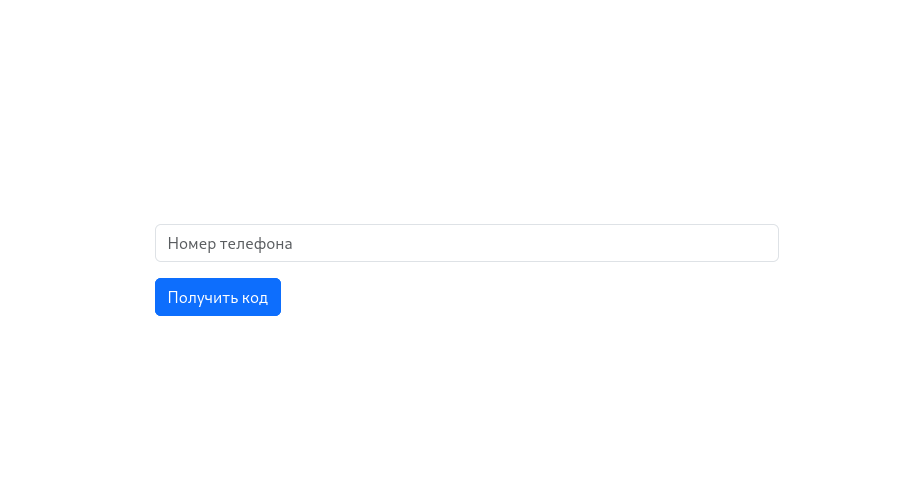
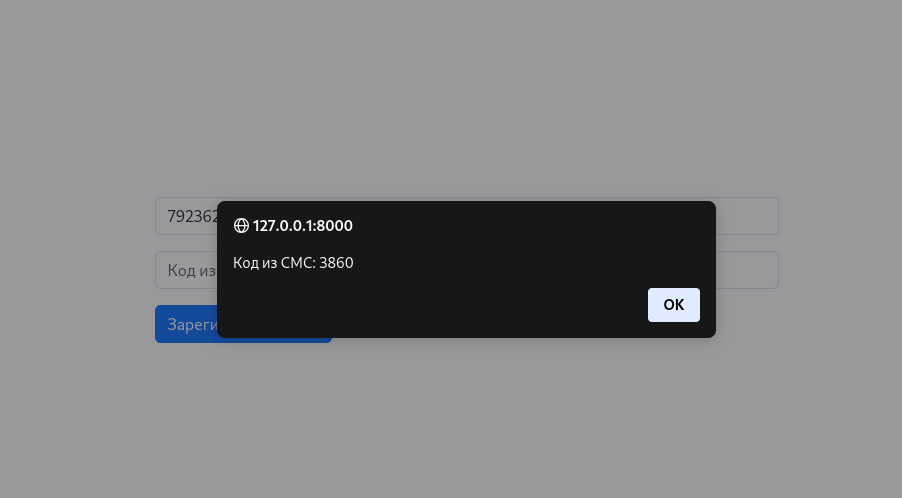
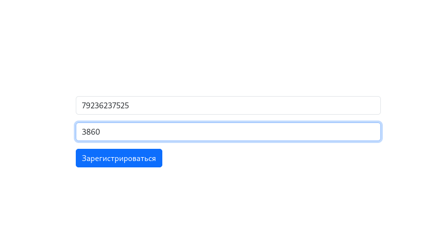
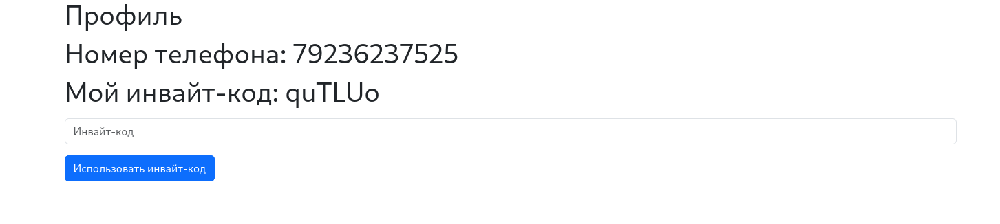

# Phone-authorizer

## Техническое задание
В рамках данного проекта необходимо разработать реферальную систему, которая позволяет пользователям регистрироваться и авторизовываться по номеру телефона, а также использовать и распространять инвайт-коды. 

Эта система будет иметь минимальный интерфейс для тестирования, однако вся логика работы с пользователями и их инвайт-кодами должна быть тщательно проработана и задокументирована.

Реализовать логику и API для следующего функционала:

1. Авторизация по номеру телефона: 

    - Пользователь вводит свой номер телефона для авторизации.

    - Система имитирует отправку 4-значного кода авторизации (с задержкой на сервере 1-2 секунды).

    - Пользователь вводит полученный код для завершения процесса авторизации.

    - Если пользователь ранее не авторизовывался, его данные записываются в базу данных.
2. Запрос на профиль пользователя: 

    - При первой авторизации пользователю присваивается случайно сгенерированный 6-значный инвайт-код, состоящий из цифр и символов.

    - В профиле у пользователя должна быть возможность ввести чужой инвайт-код, при этом проверяется его существование в системе.

    - В профиле можно активировать только один инвайт-код. Если пользователь уже активировал инвайт-код, он должен отображаться в соответствующем поле при запросе профиля пользователя.

    - API профиля должно выводить список пользователей (номеров телефона), которые ввели инвайт-код текущего пользователя.

3. API документация: 

    - Реализовать и описать в README.md API для всего функционала, включая примеры запросов и ответов.

    - Создать и прислать Postman коллекцию со всеми запросами для тестирования API.

    - Документировать API с использованием ReDoc для удобной и понятной автодокументации.

4. Интерфейс: 

    - Реализовать интерфейс на Django Templates для базового тестирования функционала.

5. Контейнеризация: 

    - Проект должен быть завернут в Docker для облегчения развертывания и обеспечения переносимости.

## API

1. users/v1
    - GET /: Получить список всех пользователей платформы

        Пример ответа:
        ```json
        [
            {
                "id": 4,
                "phone": "+79236237525",
                "referral_code": "nx5fa7",
                "invited_users": [],
                "invited_by": {
                    "phone": "89236237525"
                },
                "referral_code_used": true
            },
            {
                "id": 12,
                "phone": "89236237525",
                "referral_code": "5EXuZx",
                "invited_users": [
                    {
                        "phone": "+79236237525"
                    },
                    {
                        "phone": "+76239237525"
                    }
                ],
                "invited_by": null,
                "referral_code_used": false
            },
            {
                "id": 13,
                "phone": "+76239237525",
                "referral_code": "fuytEF",
                "invited_users": [],
                "invited_by": {
                    "phone": "89236237525"
                },
                "referral_code_used": true
            }
        ] 
        ```

    - GET /?phone=: Поиск пользователя по номеру телефона

        Пример ответа:
        ```json
        {
                "id": 12,
                "phone": "89236237525",
                "referral_code": "5EXuZx",
                "invited_users": [
                    {
                        "phone": "+79236237525"
                    },
                    {
                        "phone": "+76239237525"
                    }
                ],
                "invited_by": null,
                "referral_code_used": false
        }
        ```

    - POST /sms_request/: Запрос на получение смс-кода 

        Пример запроса: 
        ```json
        {
            "phone": "+79236237525"
        }
        ```
        Пример ответа:

        ```json
        {
            "sms": "9892"
        }
        ```
    - POST /: Аутентификация по смс-коду

        Пример запроса:

        ```json
        {
            "phone": "+79236237525",
            "sms": "9892"
        }
        ```
        Пример ответа:

        ```json
        {
            "phone": "+79236237525",   
            "token":"e9bf4c107a177b8af05c19b1ab7c63f90f30dad6"
        }
        ```

    - GET /{id}/: Профиль пользователя

        Пример ответа:

        ```json
        {
            "phone": "+79236237525",
            "referral_code": "ZuoK5K",
            "invited_users": [],
            "invited_by": null,
            "referral_code_used": false
        }
        ```
    - PUT /{id}/: Полное обновление профиля пользователя

        Пример запроса:

        ```json
        {
            "phone": "89999999999",
            "referral_code": "ZuoK5K",
            "invited_users": [],
            "invited_by": null,
            "referral_code_used": false
        }
        ```
        Пример ответа:

        ```json
        {
            "phone": "89999999999",
            "referral_code": "ZuoK5K",
            "invited_users": [],
            "invited_by": null,
            "referral_code_used": false
        }
        ```
    - PATCH /{id}/: Частичное обновление профиля пользователя

        Пример запроса:

        ```json
        {
            "phone": "+79236237525",
        }
        ```
        Пример ответа:

        ```json
        {
            "phone": "+79236237525",
            "referral_code": "ZuoK5K",
            "invited_users": [],
            "invited_by": null,
            "referral_code_used": false
        }
        ```
    - DELETE /{id}/: Удаление пользователя

    - POST /activate_code/: Активация инвайт-кода

        Пример запроса:

        ```json
        {
            "phone": "+79236237525",
            "code": "nx5fa7"
        }
        ```

## Frontend часть для тестирования функционала

1. Страница Авторизации domain/
    
    - Форма запроса смс-кода
    

    - Имитация получения смс-кода с небольшой задержкой в виде алерта
    

    - Форма аутентификации по смс-коду
    


2. Страница профиля domanin/profile/?phone=

    - После успешной аутентификации редирект на страницу профиля
    

    - Поле для ввода инвайт-кода отображается, если пользователь не вводил инвайт-код, в противном случае отображается номер телефона пользователя, чей инвайт-код был использован. Дополнительно отображается список пользователей, которые ввели инвайт-код текущего пользователя
    

## Запуск проекта
